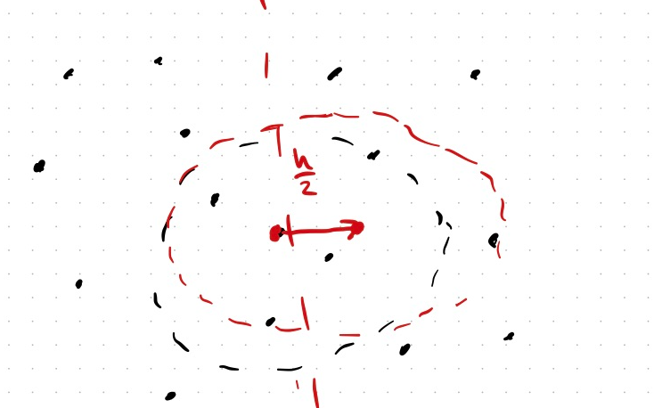

# Integrator

Summarizing problems/challenges/solutions **regarding *predictor-corrector* integrators.**

## Problem/Challenge

* Predictor-Corrector integrator for parallel SPH including self-gravity

### Possible solutions

#### Not assigning to correct process

* **not applicable for gravity, since tree is corrupt!**
	* it is not possible to obtain correct pseudo-particles if particles are not necessarily on the correct process!!! 
* possible for SPH **if particles do not move further than half a smoothing length**
	* SPH simulation without gravity 
	* decouple gravity from SPH 

and/or: 

> Was, wenn wir einfach fuer alle Subzeitschritte im Integrationsintervall: (1) die WWPartner gleich lassen und (2) die Gravitationskraefte gleich lassen, d.h. die Kraefte von der 1. rhs nehmen. Letzteres machen wir in miluphcuda auch, bzw. noch viel laenger (option -D for decouple hydro and gravity), weil der hydrozeitschritt so massiv klein ist und sich die Teilchenpositionen kaum aendern. (1) hat einen Fehler, der aber eher klein ist.

**Notes:**

* possible to use *reduced particle struct* (`IntegratedParticles`)

#### *Brute-Force*

**inevitable for predictor-corrector self-gravity!**

* for each sub-step complete *rhs()*
	* including assigning particles to correct process 
* subsequent **challenges/problems:**
	* it is not sufficient to use *reduced particle struct* (`IntegratedParticles`)
		* instead *#substeps = #particle structs* 
	* immense communication and aligning necessary
		* `uid` particle entry needed for
			* deciding what needs to be send (and received)
			* resorting/aligning particle entries

sample for heun/predictor-corrector-euler:

* `rhs()` using first particle struct
* `predictor()` writing to second particle struct
* `rhs()` using second particle struct (updated positions, ...)
	* Attention: particles may move to another process
		* consequence: different and differently sorted particles within first and second particle struct 
* `corrector()`
	* particle exchange for second particle struct (in order to have correct particles on each process)
		* compare `uid` entries of first and second particle struct
		* find missing particle *uids* and generate array: `missing_uids`
		* `MPI_Allgatherv()` in order to generate `global_missing_uids`
			* including prior send and receive length communication (via e.g. `MPI_Allgather()`)
		* removing *uids* within `missing_uids` that are available within `uids` of first particle struct (and same for **all** particle entries)
		* extend `uids` of second particle struct with *uids* that are within `global_missing_uids` but not within `uids` of first particle struct and remember indices within `global_missing_uids`: (call it) `mapping`
		* exchange **all** the particles entries using `MPI_Allgatherv()` and copy to entrie of second particle struct accordingly to `mapping`
		* sort **all entries** for both first and second particle struct according to `uid` to have aligned arrays
		* *actual* corrector() step   

_____

## Solutions/Approaches to target challenges

### Decouple gravity and do not assign to correct process within substeps

* Assumptions:
	* $h = const.$
	* $\Delta t v_{max} < \frac{h}{2}$ whereas $h$ is a global or maximal $h$ 

#### Problems

* **Variable Smoothing length**
	* if substeps smoothing length $h_1$ is smaller than the original substep's one $h_0$, thus $h_0 < h_1$, it is possible that possible interaction partners are neglected
* **Multiple substeps** (e.g. RK4)
	* $\Delta t v_{max} < \frac{h}{2}$ need to be valid for all substeps
		* thus, how to grant that: $(\Delta t_0 v_{max,0} + \Delta t_1 v_{max,1}) < \frac{h}{2}$ ?

#### Possible solutions

* **Variable Smoothing length**
	1. **Preliminary solution:** *decouple* smoothing length (no smoothing length changes allowed within substeps)
	2. additional condition on increasing smoothing lengths within substeps
		* e.g.: $\Delta h < h_{max}$, consequently searching particles to be send within radius $2 \cdot h_{max}$   
* **Multiple substeps** (e.g. RK4)
	* condition need altered from $\Delta t v_{max} < \frac{h}{2}$ to $|x_{i} - x_{0}| < \frac{h}{2})$ whereas $x_{0}$ is the original position and $x_{i}$ the *i-th* predicted position

# Different Smoothing lengths

* neglect interaction if particle within smoothing length of other particle but not vice-versa
	* better: include interaction if particle within smoothing length of other particle but not vice-versa

______

* particles attributes:
	* save $\mu_{ij, max}$ for integrator (time step determination) 
	* use max($\mu_{ij, max}$) for determining timestamp
	 
* save:
	* sound speed *cs* (but for me not really necessary)
	* *sml* if `INTEGRATE_SML || VARIABLE_SML`
* **do not** save:
	* *nnl*, *noi*

 	